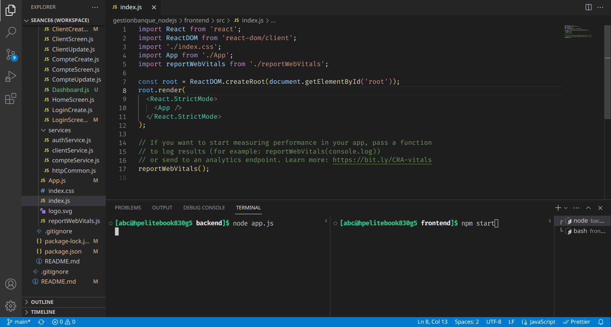

# GestionBanque : NodeJS + ReactJS

## Getting started

New project to learn NodeJS ( Express ) & ReactJS technologies.
A simple web application to manage client accounts.

  |  

## Visuals


## Test and Run (On Linux)

- Import Project
```bash
$ git commit https://github.com/0xUNS/gestionbanque_nodejs.git
$ cd gestionbanque_nodejs
```

- BackEnd Directory
```bash
$ npm install
$ node app.js
```
> Open API on: [http://localhost:8080](http://localhost:8080)

- FrontEnd Directory
```bash
$ npm install
$ cd frontend
$ npm start
```
> Open App on :  [http://localhost:3000](http://localhost:3000)

## Installation

Commands to start new project :

- NodeJs (Dir: backend)
```bash
$ npm init -y

$ npm install express
$ npm install dotenv
$ npm install mongoose
```

- Reactjs (Dir: frontend)
```bash
$ npx create-react-app frontend

$ npm install axios
$ npm install react-router-dom
$ npm install react-router-bootstrap
$ npm install react-bootstrap bootstrap
```

## Rest API
HTTP request methods: `GET`, `POST`, `PUT`, `DELETE`.

example of `/clients/` route:

```
GET		/clients/		# Get list of clients
GET		/clients/:id	# Get a client by ID
POST	/clients/		# create new client
PUT		/clients/:id	# edit client by id
DELETE	/clients/:id	# delete client by id
```

other routes : `auth` & `comptes` .

## React Routes

```
/
|- signup
|- login
|- logout
|- clients
	|- create
	|_ edit/:id
|_ comptes
	|- create
	|_ edit/:id
```


## Roadmap
- Add this project to Docker Container

- Work on `authentication` to make it proper


## Project status
This project was made as part of Learning NodeJS -Express- & ReactJS. It may be full of errors and bugs.